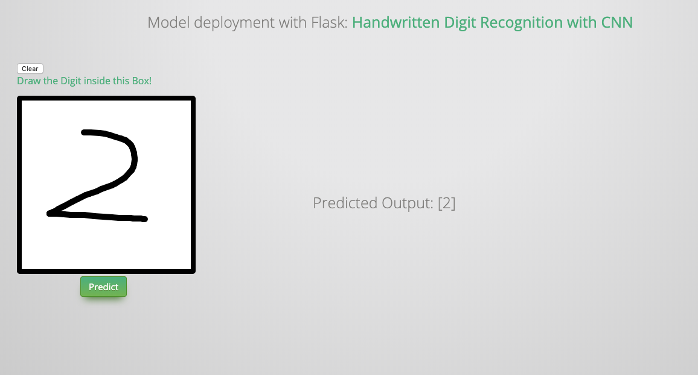

.. _deploy:

===========================
Model Deployment with Flask
===========================

In this chapter, you’ll learn how to deployment your model with ``flask``. The main idea and code (I made some essential modification to make it work for Python 3) are from the Git repo:https://github.com/llSourcell/how_to_deploy_a_keras_model_to_production. So the copyright belongs to the original author. 

Install ``flask``
+++++++++++++++++

.. code-block:: bash

	pip install Flask

Train and Save your model 
+++++++++++++++++++++++++

You can use the following code to train and save your ``CNN`` model:

.. code-block:: python

	#python 2/3 compatibility
	from __future__ import print_function
	#simplified interface for building models 
	import keras
	#our handwritten character labeled dataset
	from keras.datasets import mnist
	#because our models are simple
	from keras.models import Sequential
	#dense means fully connected layers, dropout is a technique to improve convergence, flatten to reshape our matrices for feeding
	#into respective layers
	from keras.layers import Dense, Dropout, Flatten
	#for convolution (images) and pooling is a technique to help choose the most relevant features in an image
	from keras.layers import Conv2D, MaxPooling2D
	from keras import backend as K

	#mini batch gradient descent ftw
	batch_size = 128
	#10 difference characters
	num_classes = 10
	#very short training time
	epochs = 12

	#input image dimensions
	#28x28 pixel images. 
	img_rows, img_cols = 28, 28

	#the data downloaded, shuffled and split between train and test sets
	#if only all datasets were this easy to import and format
	(x_train, y_train), (x_test, y_test) = mnist.load_data()

	#this assumes our data format
	#For 3D data, "channels_last" assumes (conv_dim1, conv_dim2, conv_dim3, channels) while 
	#"channels_first" assumes (channels, conv_dim1, conv_dim2, conv_dim3).
	if K.image_data_format() == 'channels_first':
	    x_train = x_train.reshape(x_train.shape[0], 1, img_rows, img_cols)
	    x_test = x_test.reshape(x_test.shape[0], 1, img_rows, img_cols)
	    input_shape = (1, img_rows, img_cols)
	else:
	    x_train = x_train.reshape(x_train.shape[0], img_rows, img_cols, 1)
	    x_test = x_test.reshape(x_test.shape[0], img_rows, img_cols, 1)
	    input_shape = (img_rows, img_cols, 1)

	#more reshaping
	x_train = x_train.astype('float32')
	x_test = x_test.astype('float32')
	x_train /= 255
	x_test /= 255
	print('x_train shape:', x_train.shape)
	print(x_train.shape[0], 'train samples')
	print(x_test.shape[0], 'test samples')

	#convert class vectors to binary class matrices
	y_train = keras.utils.to_categorical(y_train, num_classes)
	y_test = keras.utils.to_categorical(y_test, num_classes)

	#build our model
	model = Sequential()
	#convolutional layer with rectified linear unit activation
	model.add(Conv2D(32, kernel_size=(3, 3),
	                 activation='relu',
	                 input_shape=input_shape))
	#again
	model.add(Conv2D(64, (3, 3), activation='relu'))
	#choose the best features via pooling
	model.add(MaxPooling2D(pool_size=(2, 2)))
	#randomly turn neurons on and off to improve convergence
	model.add(Dropout(0.25))
	#flatten since too many dimensions, we only want a classification output
	model.add(Flatten())
	#fully connected to get all relevant data
	model.add(Dense(128, activation='relu'))
	#one more dropout for convergence' sake :) 
	model.add(Dropout(0.5))
	#output a softmax to squash the matrix into output probabilities
	model.add(Dense(num_classes, activation='softmax'))
	#Adaptive learning rate (adaDelta) is a popular form of gradient descent rivaled only by adam and adagrad
	#categorical ce since we have multiple classes (10) 
	model.compile(loss=keras.losses.categorical_crossentropy,
	              optimizer=keras.optimizers.Adadelta(),
	              metrics=['accuracy'])

	#train
	model.fit(x_train, y_train,
	          batch_size=batch_size,
	          epochs=epochs,
	          verbose=1,
	          validation_data=(x_test, y_test))
	 #how well did it do? 
	score = model.evaluate(x_test, y_test, verbose=0)
	print('Test loss:', score[0])
	print('Test accuracy:', score[1])

	#Save the model
	# serialize model to JSON
	model_json = model.to_json()
	with open("model.json", "w") as json_file:
	    json_file.write(model_json)
	# serialize weights to HDF5
	model.save_weights("model.h5")
	print("Saved model to disk")

Deplyment with Flask
++++++++++++++++++++

.. code-block:: python 

	#our web app framework!

	#you could also generate a skeleton from scratch via
	#http://flask-appbuilder.readthedocs.io/en/latest/installation.html

	#Generating HTML from within Python is not fun, and actually pretty cumbersome because you have to do the
	#HTML escaping on your own to keep the application secure. Because of that Flask configures the Jinja2 template engine 
	#for you automatically.
	#requests are objects that flask handles (get set post, etc)
	from flask import Flask, render_template,request
	#scientific computing library for saving, reading, and resizing images
	#from scipy.misc import imsave, imread, imresize
	# import cv2 library for saving, reading, and resizing images
	import cv2
	#for matrix math
	import numpy as np
	#for importing our keras model
	import keras.models
	#for regular expressions, saves time dealing with string data
	import re
	# for convert base64 string to image
	import base64

	#system level operations (like loading files)
	import sys 
	#for reading operating system data
	import os
	#tell our app where our saved model is
	sys.path.append(os.path.abspath("./model"))
	from load import * 
	#initalize our flask app
	app = Flask(__name__)
	#global vars for easy reusability
	global model, graph
	#initialize these variables
	model, graph = init()

	#decoding an image from base64 into raw representation
	def convertImage(imgData1):
		imgData1 = imgData1.decode("utf-8")
		imgstr = re.search(r'base64,(.*)',imgData1).group(1)
		#print(imgstr)
		imgstr_64 = base64.b64decode(imgstr)
		with open('output/output.png','wb') as output:
			output.write(imgstr_64)
		

	@app.route('/')
	def index():
		#initModel()
		#render out pre-built HTML file right on the index page
		return render_template("index.html")

	@app.route('/predict/',methods=['GET','POST'])
	def predict():
		#whenever the predict method is called, we're going
		#to input the user drawn character as an image into the model
		#perform inference, and return the classification
		#get the raw data format of the image
		imgData = request.get_data()
		#print(imgData) 
		#encode it into a suitable format
		convertImage(imgData)
		print("debug")
		#read the image into memory
		x = cv2.imread('output/output.png',0)
		#compute a bit-wise inversion so black becomes white and vice versa
		x = np.invert(x)
		#make it the right size
		x = cv2.resize(x,(28,28))
		#imshow(x)
		#convert to a 4D tensor to feed into our model
		x = x.reshape(1,28,28,1)
		print("debug2")
		#in our computation graph
		with graph.as_default():
			#perform the prediction
			out = model.predict(x)
			#print(out)
			print(np.argmax(out,axis=1))
			print("debug3")
			#convert the response to a string
			response = np.array_str(np.argmax(out,axis=1))
			return response	
		

	if __name__ == "__main__":
		#decide what port to run the app in
		port = int(os.environ.get('PORT', 5000))
		#run the app locally on the givn port
		app.run(host='0.0.0.0', port=port)
		#optional if we want to run in debugging mode
		#app.run(debug=False)

Lunch your app on server
++++++++++++++++++++++++

1. Lunch the APP 
----------------

.. code-block:: python 

	python app.py

2. Run the APP
--------------

Open the browser with: http://0.0.0.0:5000

.. _fig_model_cnn:

.. _My ststspy library: https://runawayhorse001.github.io/statspy/
