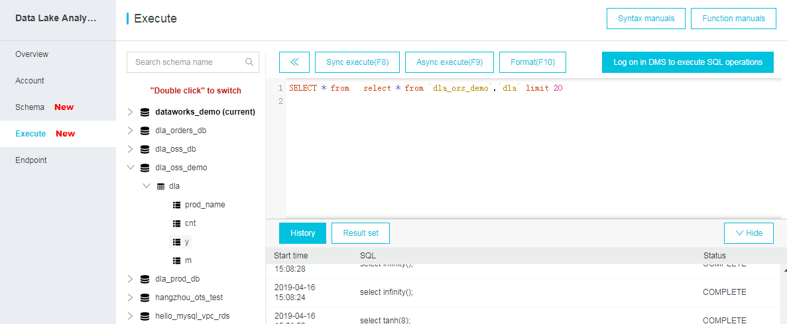

.. _ingest:

=====================================
Data Read and Ingestion with DataBase  
=====================================

.. |nb| replace:: ``Jupyter Notebook``
.. |zp| replace:: ``Zeppelin``
.. |py| replace:: ``Python``

Data Ingestion from Local to DataBase 
+++++++++++++++++++++++++++++++++++++

.. code-block:: python

	# User Information
	try:
	    login = pd.read_csv(r'login.txt', header=None)
	    user = login[0][0]
	    pw = login[0][1]
	    print('User information is ready!')
	except:
	    print('Login information is not available!!!')

	# Database information
	host = '##.###.###.##'
	db_name = 'db_name'
	table_name = 'table_name'

	# Setup connection
	conn = psycopg2.connect(host=host, database=db_name, user=user, password=pw)
	cur = conn.cursor()

	# Creat table in DataBase
	conn.commit()
	query = """
	    DROP TABLE IF EXISTS {table_name};
	    CREATE TABLE {table_name}
	    (   id character varying(20)
	      , val1 double precision
	      , val2 double precision
	      , val3 double precision
	      , val4 text
	    )
	    DISTRIBUTED BY (id);
	    GRANT SELECT ON TABLE {table_name} TO xxxx;
	    """.format(table_name=table_name)
	cur.execute(query)
	conn.commit()

	# load the data
	df = pd.read_csv('xx.csv') 

	# Write dataframe to memory as csv
	csv_io = io.StringIO()
	df.to_csv(csv_io, sep='\t', header=True, index=False)
	csv_io.seek(0)

	# Copy the dataframe in memory to GP
	conn.commit()
	copy_sql = """
	           COPY {table_name} FROM stdin WITH CSV HEADER
	           DELIMITER as '\t'
	           """.format(table_name=table_name)
	cur.copy_expert(sql=copy_sql, file=csv_io)
	conn.commit()

.. note::

   You can also use ``copy_to`` to copy the dataframe from local memory to GP

   .. code-block:: python
   
		cur.copy_to(df, table_name)

Data Read from DataBase to Local  
++++++++++++++++++++++++++++++++

.. code-block:: python

	# User information
	try:
	    login = pd.read_csv(r'login.txt', header=None)
	    user = login[0][0]
	    pw = login[0][1]
	    print('User information is ready!')
	except:
	    print('Login information is not available!!!')

	# Database information
	host = '##.###.###.##'
	db_name = 'db_name'
	table_name = 'table_name'

	# Setup connection
	conn = psycopg2.connect(host=host, database=db_name, user=user, password=pw)
	cur = conn.cursor()

	# Read table
	sql = """
	      select *
	      from {table_name}
	      """.format(table_name=table_name)
	dp = pd.read_sql(sql, conn)

Connect to various DataBases (``pyodbc``)
+++++++++++++++++++++++++++++++++++++++++
One open source python library ``pyodbc`` makes accessing ODBC databases simple.
For example, it can connect with Google BigQuery, Hive from Ubuntu / Debian, Microsoft Excel, Microsoft SQL Server etc.

.. code-block:: python

    # set up DSN (database source name) connection
    import pyodbc
    conn = pyodbc.connect('DRIVER={ODBC Driver 17 for SQL Server};SERVER={server};DATABASE={db};UID={user};PWD={password}')
    query_string = "SQL QUERY"

    import pandas as pd
    df = pd.read_sql(query_string, conn)

Hive and Impala Table Ingestion
+++++++++++++++++++++++++++++++

.. _fig_ali:

